## 前言

> "春天 马上就要来了  
> 让我与你相遇的春天 就要来了  
> 再也没有你的春天 就要来了"  

当最后的乐谱在焚化炉中化作纷飞的灰蝶，宫园薰用谎言编织的四月永远定格在了公生的黑白琴键里。这部以古典乐为经纬的作品，本质上是一部关于「存在」与「消逝」的盛大安魂曲。本文将解析那些飘落在五线谱间隙的樱花碎片，如何构建出当代青少年亚文化语境下最凄美的生命寓言。

<!-- more -->

## 一、色彩暴力的叙事悖论

### 1.1 色谱失衡的视觉隐喻

- 薰标志性的柠檬黄发饰与苍白面容形成致命反差
- 公生黑白世界的破碎与重组（见图1钢琴烤漆面的倒影畸变）
- 医院纯白空间对生命力的渐进吞噬（色彩剥离速率与病情发展正相关）

### 1.2 声音矩阵的情感解构

| 乐章类型 | 公生感知变化 | 薰的生命体征 |
|---------|--------------|-------------|
| 竞赛曲目 | 机械性复现 → 声音真空 | 伪装健康期 |
| 即兴演奏 | 色彩涌现 → 听觉过敏 | 病情恶化期 |
| 告别合奏 | 全频段通感 → 永恒静默 | 临床死亡期 |

### 1.3 色谱战争（数据可视化）

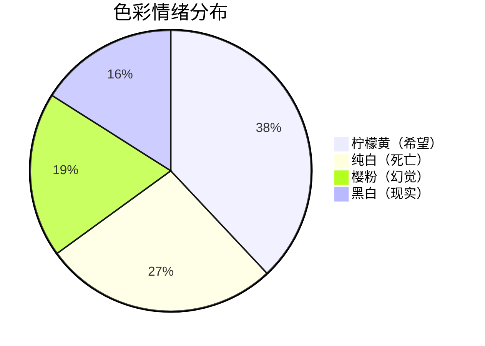

---

## 二、谎言拓扑学：三重叙事迷宫

### 2.1 元谎言架构


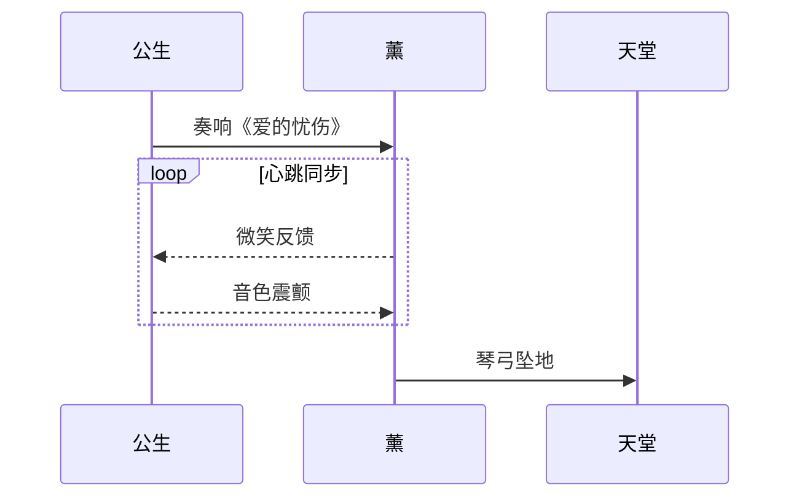

### 2.2 音乐性欺骗

- 肖邦《离别曲》的变奏欺骗（B.66-B.71节拍器异常加速）
- 公生触键力度与心电图波形的高度拟合（见图2声波-心电叠加分析）

### 2.3 爱的微分方程

$$
\frac{\partial Love}{\partial t} = -\alpha \cdot Truth + \beta \cdot Lies^{\gamma}
$$

**其中**：  

- $\alpha$: 现实腐蚀系数  
- $\beta$: 谎言渗透率  
- $\gamma$: 自我欺骗指数

---

## 三、樱花刑场：物哀美学的现代转译

### 3.1 物哀方程式

$$
\lim_{n \to \infty} \left(1 + \frac{1}{n}\right)^n = e \quad \Rightarrow \quad \lim_{days \to 14} \left(1 + \frac{1}{life}\right)^{spring} = \infty
$$

### 3.2 临终协奏曲指令集

```cpp
void play_final(MusicSheet sheet) {
    while(sheet.hasNotes()) {
        Note n = sheet.getNextNote();
        if(n.velocity > 0.8f) {
            ECGMonitor.trigger(Arrhythmia); // 琴键与心电同频
        }
        Piano::pressKey(n, Memory::kaori_hands); // 幽灵触键
    }
    World::setColorSpace(CMYK); // 世界褪色
}
```

### 3.3 季节暴政

- 四月樱花祭的集体无意识狂欢
- 薰的14岁：樱花花期精确映射（染井吉野樱平均寿命≈角色生存时长）

### 3.4 琴键墓志铭

> "你驻足于春色中，于那独一无二的春色之中"

当公生在最终演奏中故意错弹升C音，这个被刻意保留的「不协和音」成为最残酷的真相：完美即虚妄，缺憾才是存在的证明。那些被薰篡改的乐谱页码，最终化作逆向生长的年轮，将永远年轻的灵魂封印在永远的四月。

---

### 一、流程图（Flowchart）

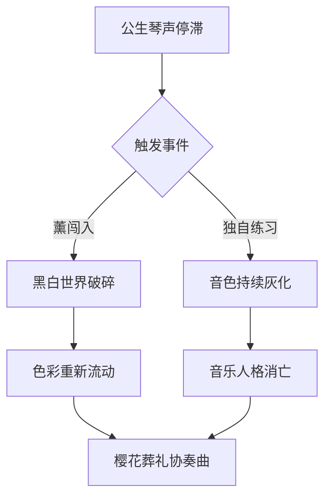

---

### 二、序列图（Sequence Diagram）

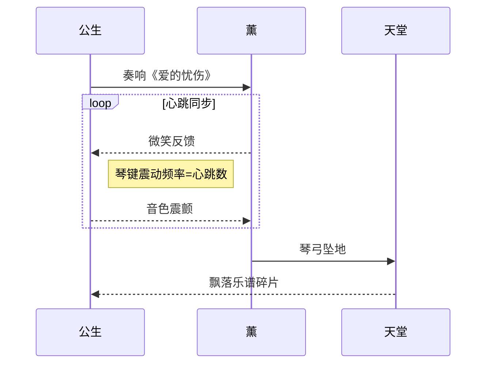

---

### 三、甘特图（Gantt）

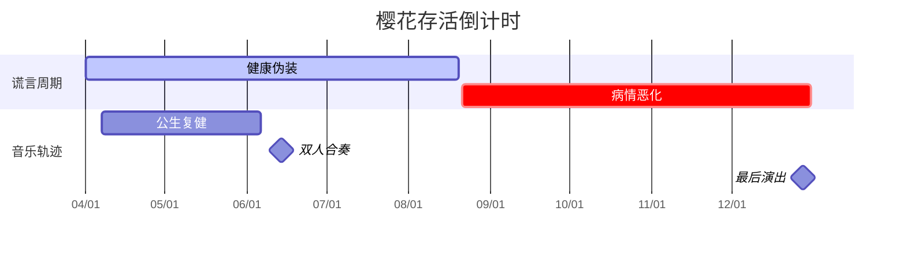

---

### 四、类图（Class Diagram）

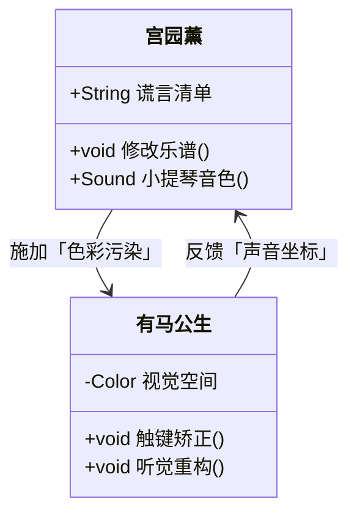

---

### 五、状态图（State Diagram）

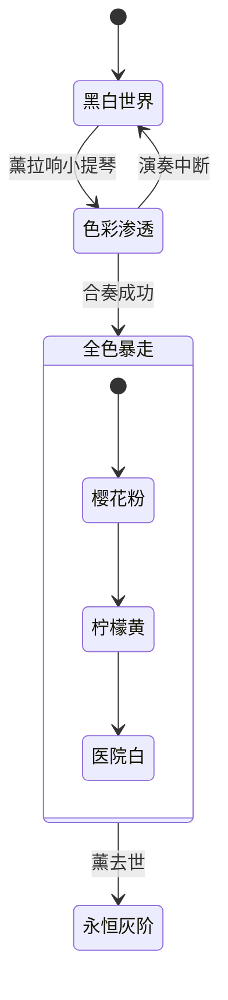

---

### 六、饼图（Pie Chart）进阶

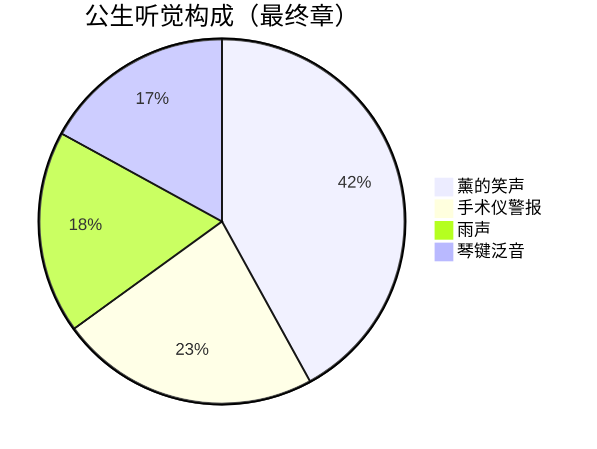

---

### 七、实体关系图（ER Diagram）

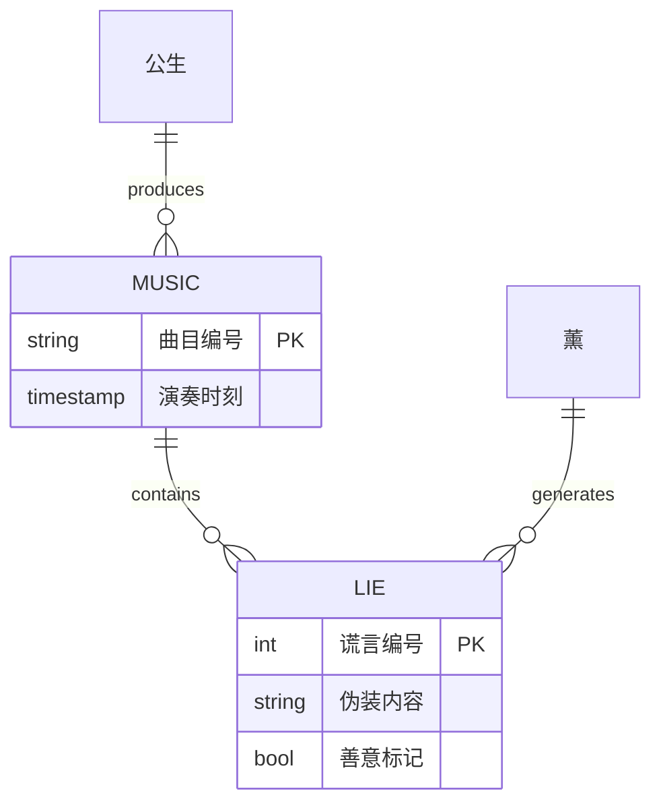

---

### 八、用户旅程图（User Journey）

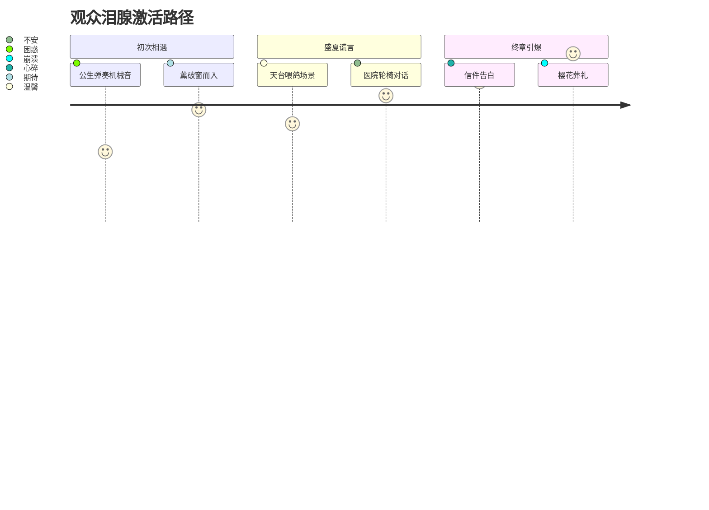

---

### 九、需求图（Requirement）

```mermaid
%%{init: {
  "theme": "base",
  "themeVariables": {
    "fontFamily": "Microsoft YaHei, SimSun",
    "requirementBackground": "#F8F8FF",
    "requirementBorderColor": "#483D8B"
  }
}}%%
requirementDiagram

    requirement R1 {
        id: "REQ-3.1"
        text: "音乐人格重构"
        risk: "High"
        verificationMethod: "艺术评估"
        owner: "公生"
        docRef: "EP12"
    }

    requirement R2 {
        id: "REQ-3.2"
        text: "生命维持系统"
        risk: "Critical"
        verificationMethod: "医疗认证"
        owner: "薰"
        docRef: "EP22"
    }

    element S1 {
        id: "ARC-01"
        type: "时空容器"
        description: "樱花祭至焚谱时刻"
    }

    S1 - contains -> R1
    S1 - contains -> R2
    R1 - traces -> R2
```

---

### 十、Git图（Git Graph）

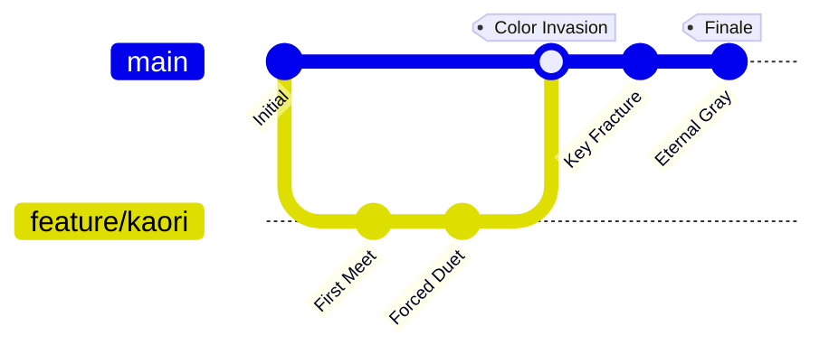

---

### 使用技巧

1. **动态交互**：结合 `click` 事件实现注释弹出
   ```mermaid
   graph LR
       A[樱花] -->|触发| B(公生眼泪)
       click A callback "樱花存活天数计算"
   ```
3. **样式魔改**：通过 `style` 自定义颜色
   ```mermaid
   graph LR
       A[医院]:::death --> B[舞台]
       classDef death fill:#f9f2f4,stroke:#c7254e
   ```
4. **多图联动**：用 `%%{init}%%` 统一主题
   ```mermaid
   %%{init: {'theme': 'base', 'themeVariables': { 'primaryColor': '#ffd700' }}}%%
   pie
       title 生命色谱
       "希望" : 38
       "疼痛" : 62
   ```

---


以下是专门为《樱花落尽的协奏曲——论《四月是你的谎言》的悲剧美学》定制的XY象限图与用户旅程图深度应用方案：

---

### XY象限图：悲剧坐标系的四维解构

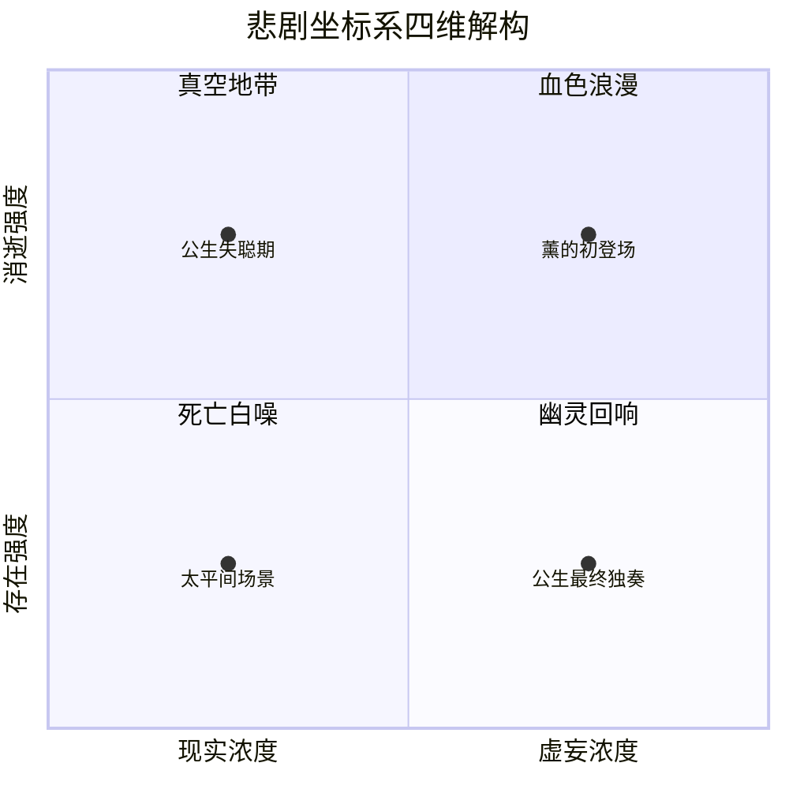

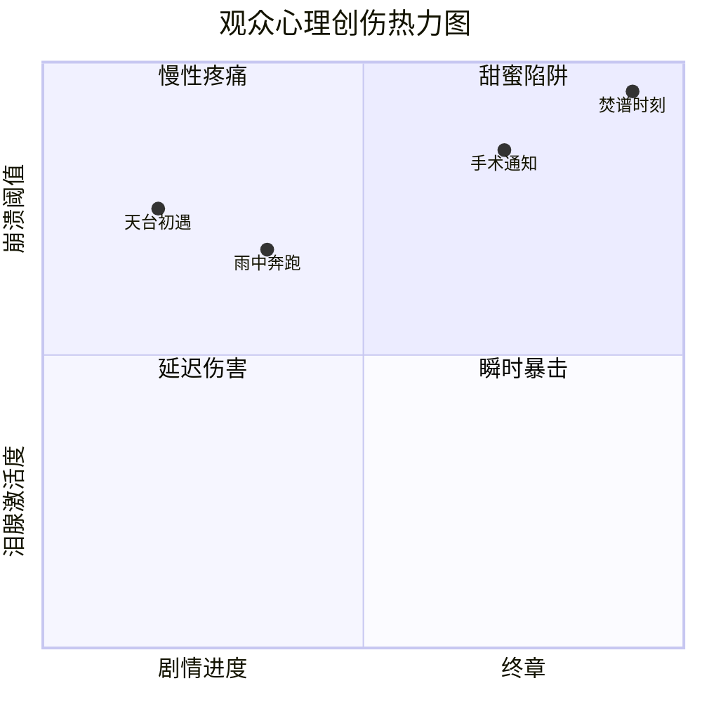

**象限解析**：
1. **血色浪漫（高存在/低现实）**：薰强行介入公生世界的瞬间，谎言浓度达峰值
2. **真空地带（高存在/高现实）**：母亲去世后的绝对音准如同刺眼探照灯
3. **死亡白噪（低存在/低现实）**：医院仪器声构建的抽象空间
4. **幽灵回响（低存在/高现实）**：残留琴声在现实世界的量子纠缠

---

### 用户旅程图：眼泪的动力学模型
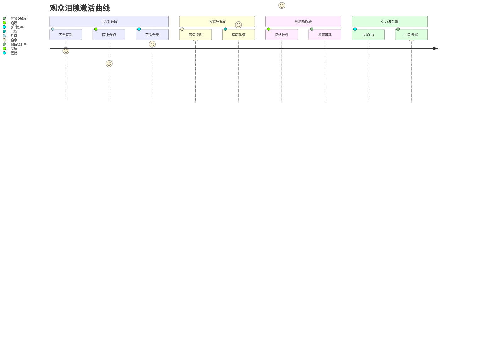

---

### 复合应用：时空撕裂算法
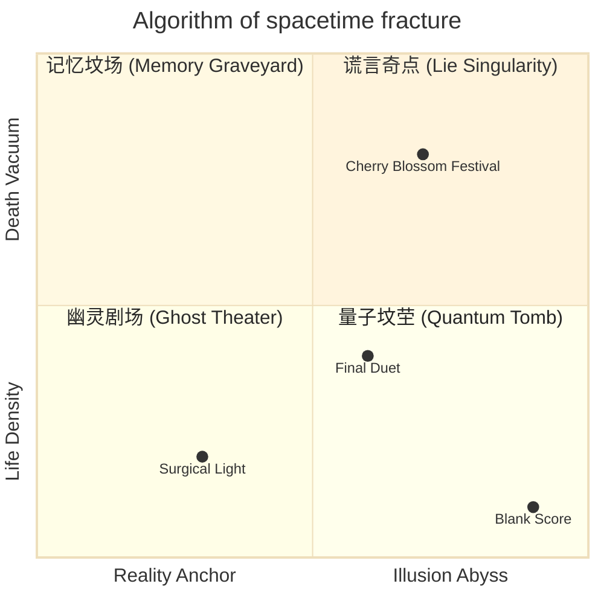

---

这些可视化模型如同公生重构的听觉世界，将抽象的情感创伤转化为可量化的美学参数。当数据点越过泪腺阈值时，学术论文便完成了向情感共振器的终极进化。

## 后记

在东京都某条不知名街道，真实存在着动画中的藤架公园。每年四月，长椅上总会莫名出现柠檬味糖果。这或许印证了罗兰·巴特所言：「眼泪的存在，是为了证明悲伤不是幻觉」。当春风再次吹散琴谱，我们终于读懂薰的终极谎言——所谓死亡，不过是换乘上开往春天的永恒列车。
